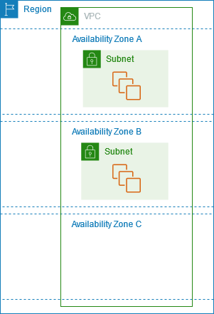

# AWS Study - Week 01

## Region, Availability Zone

참고자료

https://docs.aws.amazon.com/ko_kr/AWSEC2/latest/UserGuide/using-regions-availability-zones.html#concepts-regions

https://aws.amazon.com/ko/about-aws/global-infrastructure/regions_az/

https://docs.aws.amazon.com/global-infrastructure/latest/regions/aws-regions-availability-zones.html?

### 무엇인가?

Region : AWS 인프라를 지리적으로 나누어 배포한것을 의미, 일반적으로 사용자는 AWS region 선택 시 가장 가까운 region을 선택함(서로 분리된 지리적 영역)

=> AWS가 실제 데이터 센터를 배치해 서비스를 제공하는 지리적 지역

region 내부에는 Availability Zone가 또 있다.(region내부에 존재하는 서로 독립된 위치)

Availability Zone : 각 region내에 격리된 위치

Availability Zone)

사진에서 보면 각 availability Zone안에는 서브넷이 있고 서브넷 안에 EC2가 있다.

### 왜 사용하는가?

Region : 사용자 위치, 규제, 지연시간 등을 고려해 지리적 영역을 선택하기 위해 사용

Availability Zone : 한 데이터센터 영역의 장애가 전체 서비스 장애로 번지는 것을 막기 위해 사용

### 장점

Region
- 사용자와 가까운 Region을 선택하면 지연시간을 줄일 수 있음

Availability Zone
- 한 AZ에 장애가 나도 다른 AZ에서 서비스 가능

### 단점
Region
- Region간 데이터 전송 시 비용이 추가될 수 있음

Availability Zone
- 여러 AZ에 리소스를 배치하면 비용 증가

### 핵심

> Region는 데이터 센터가 있는 지리적 위치, Availability Zone은 그 안에서 사용할 수 있는 영역

## Local Zone

참고자료

https://docs.aws.amazon.com/global-infrastructure/latest/regions/aws-regions-availability-zones.html?

### 무엇인가?
Region보다 최종 사용자에게 더 가까운 위치에 AWS 컴퓨팅, 리소스 자원을 배치하기 위한 인프라

### 왜 사용하는가?
1. 저지연 애플리케이션(Run low-latency applications at the edge)
2. 하이브리드 클라우드 마이그레이션을 쉽게 하는 것(Simplify hybrid cloud migrations) => 회사 자체의 DB에서 AWS region으로 옮기려고 할 때, Local zone를 써서 천천히 옮긴다
3. 데이터가 특정 지역에 있어야 하는 요구사항을 지킨다(Data Residency)

### 장점
위와 동일

### 단점
1. 지원하는 AWS서비스가 제한적일 수 있다.
2. 비용이 region과 다를 수 있다

### 핵심
> 사용자와 더 가까운 위치에 AWS 컴퓨팅 자원을 배치해서 지연시간을 줄이는 것

## 학습 주제

참고자료

참고 사이트

### 무엇인가?

### 왜 사용하는가?

### 장점

### 단점

### 핵심

## Identity and Access Management

참고자료

https://docs.aws.amazon.com/ko_kr/IAM/latest/UserGuide/introduction.html

### 무엇인가?

AWS의 리소스에 대한 엑세스를 안전하게 제어할 수 있는 웹 서비스

User : 특정 사용자 계정
Role : 필요할 때 맡는 권한
Policy : 무엇을 할 수 있는가(Role의 권한 정의)

### 왜 사용하는가?

계정마다 또는 필요한 상황에 따라 권한을 다르게 주어 리소스 접근을 제어하고 사용자 인증을 위해 사용함

### 장점

- 사용자 별로 세밀한 권한 설정 가능

### 단점

- policy가 많아지면 권한 구조가 복잡해짐

### 핵심

> Policy = 무엇을 할 수 있는가

>Role = 그 권한을 누가/무엇이 임시로 사용할 수 있게 할 것인가

>User = 실제 AWS 사용자 영역

## EC2(El)

참고자료

https://aws.amazon.com/ko/ec2/

### 무엇인가?

AWS에서 빌려쓰는 가상서버 서비스

### 왜 사용하는가?

직접 서버를 구매하면 초기비용이 크고, 서버 설치와 유지보수도 필요하지만 EC2를 사용하면 필요한 순간에 서버를 만들고, 필요없으면 바로 종료가 가능하다

### 장점

- 서버를 빠르게 생성할 수 있음
- 필요한 만큼 서버 사양을 변경가능

### 단점

- 서버의 OS와 애플리케이션을 직접 관리해야함(즉 AWS에서는 가성 컴퓨터만 제공을 한다.)
-  사용하지 않아도 실행중이면 비용이 발생함

### 핵심

> EC2는 필요한 만큼 빌려쓰는 가상서버 서비스

## Intaance

참고자료

https://aws.amazon.com/ko/ec2/instance-types/

https://docs.aws.amazon.com/ko_kr/AWSEC2/latest/UserGuide/Instances.html

### 무엇인가?

EC2를 사용하여 실제로 만든 가상 컴퓨터 한대

인스턴스를 만들 때, 보통 아래와 같은것을 결정한다.
- AMI(Amazon Machine Image) : EC2를 만들기 위한 서버의 기본 이미지 => 운영체제와 기본 소프트웨어 구성을 담고 있다.
- Instance Type : EC2의 컴퓨터 성능을 정함 => CPU, 메모리, 네트워크 성능 등
- EBS(Elastic Block Store) : EC2가 사용하는 가상 하드디스크
- Security Group : EC2를 들어오고 나가는 네트워크 트래픽을 제어하는 가상 방화벽
- Key pari : EC2에 안전하게 로그인 할 때, 사용하는 인증키 

### 왜 사용하는가?

물리 서버를 직접 구매하지 않고 서버를 사용하기 위해

### 장점

- 서버를 빠르게 생성 가능
- CPU, 메모리 등 원하는 사양 선택 가능

### 단점

- OS 업데이트와 애플리케이션 관리를 직접 해야 함

### 핵심

>  EC2 Instance는 필요할 때 빠르게 생성해서 사용하는 가상 서버이다.

## EBS(Elastic block storage)

참고자료

https://docs.aws.amazon.com/ebs/

### 무엇인가?

EC2에 연결해서 사용하는 가상 하드디스크

### 왜 사용하는가?
EC2의 데이터는 서버가 재시작되거나 교체되는 상황에서도 지속적으로 보관을 해야되기 때문

### 장점

- 저장용량을 비교적 쉽게 늘릴 수 있다.
- 스냅샷으로 백업이 가능하다

### 단점

- 용량과 성능에 따라 비용이 발생한다.

### 핵심

>  EC2에 연결해서 사용하는 가상 하드디스크

## S3(Simple Storage Service)

참고자료

https://docs.aws.amazon.com/s3/

### 무엇인가?

이미지, 영상, 문서, 백업 파일같은 객체를 저장하는 대용량 스토리지

S3는 파일을 Bucket에 저장을 한다.

Bucket: 파일을 담는 큰 저장 공간

Object: 실제 저장되는 파일 

Key: 파일을 구분하는 이름/경로

### 왜 사용하는가?
서버와 파일 저장 공간을 분리하기 위해서

### 장점

- 매우 많은 데이터 저장가능
- 높은 내구성

### 단점

- 사용량에 따라 저장 및 데이터 전송 비용 발생

### EBS와 차이점
EBS : 블록 스토리지 + EC2에 붙여서 사용
S3 : 객체 스토리지 + 서버와 독립적임

### 핵심

>  S3는 AWS에서 이미지, 영상, 문서 등의 파일을 저장하는 객체 스토리지이다.